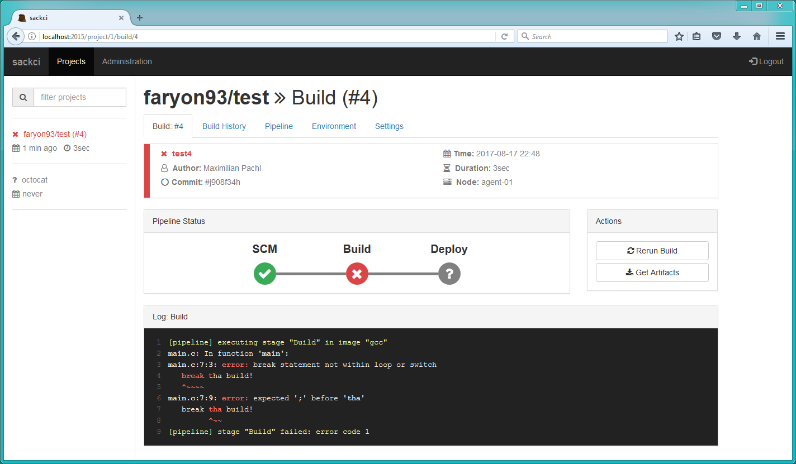

# sackci
Simple as *uck continuous integration server



## Features
- agent-less design (just a docker host is needed)
- pipeline configuration stored in project repository
- configuration in text format (storable in vcs)
- custom scm via special docker container
- realtime web interface
- REST interface (used by web ui)
- single binary, which contains all necessary data

## Architecture
The sackci server is the central node which orchestrates the builds on all "agents". On the build agents there is no software required, except a running docker daemon with exposed management api to the network.
The server periodically polls for changes from in the source repository of each project. If new changes are detected the build process is executed on one of the configured docker hosts.
All build stages are executed in seperate containers, so there is no need to have all tools you need installed on the host machine. Just pick the right docker image for your build stage.

## SCM Integration
It is possible to integrate any kind of SCM into sackci. Therefore a special docker container is needed. We provide an scm integration container for the following scm systems:

- [Git](https://github.com/faryon93/sackci-git)

The sackci server communicates with the scm container via command line arguments and return values. Each container must implement the following commands:

```
# cloning a repositoy (get a working copy of the sources)
# last line should be JSON representation of the commit details
$: docker run -t -i sackci/git:latest clone https://github.com/octocat/Hello-World.git master

# checking for repo changes
# exit code 0: no errors
# exit code 1: branch does not exist
# The last line of the console output should be the new ref,
# which is saved for future repo change detection (e.g. old-ref parameter)
$: docker run -t -i sackci/git:latest head https://github.com/octocat/Hello-World.git master
```

## Configuration
```
listen: "127.0.0.1:8181"    # address and port for the REST API to listen on
artifacts: "E:/tmp/"        # storage location of the build artifacts
database: "E:/tmp/sackci"   # storage location of the database

# build agents
agents:
   - name: "agent-01"                       # display name
     endpoint: "tcp://192.168.2.85:2375"    # docker api endpoint
     concurrent: 0                          # number of concurrent builds

# projects
projects:
   - name: "faryon93/test"                          # display name
     scm: "git"                                     # SCM provider
     repo: "https://github.com/faryon93/test.git"   # repository url
     branch: "master"                               # branch
     trigger: "poll"                                # build trigger: "manual", "poll"
     interval: 10                                   # trigger interval in seconds for polling
```

## Required Tools
To build the webfrontend some tools are required to process less files, minify the content and embed all assets into the application.
All files are stored in *assets.go*, which should be up to date at any time. In order to generate a new *assets.go* file a
simple `go generate assets/generate.go` should be enough.

- **minify**: https://github.com/tdewolff/minify
- **esc**: https://github.com/mjibson/esc
- **lessc**: https://lesscss.org/

## Notice
This project is far from beeing finished and should not be used in production. Feel free to contribute.
