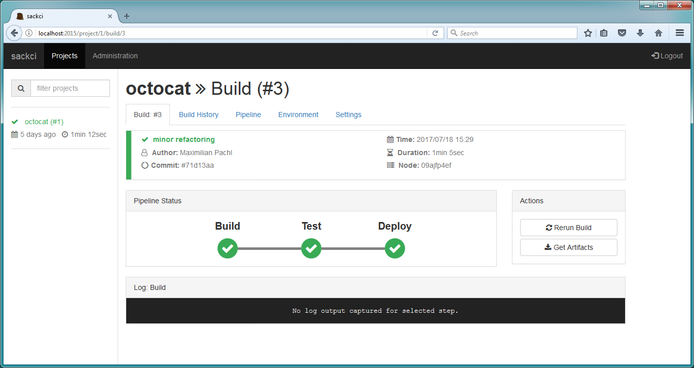

# sackci
Simple as *uck continuous integration server



## Features
- agent-less design (just a docker host is needed)
- single database file
- configuration in text format (storable in vcs)
- custom scm via special docker container
- pipeline configuration stored in project repository
- REST API and web interface with live data

## Architecture
The sackci server is the central node which orchestrates the builds on all "agents". On the build agents there is no software required, except a running docker daemon with exposed management api to the network.
The server periodically polls for changes from in the source repository of each project. If new changes are detected the build process is executed on one of the configured docker hosts.
All build stages are executed in seperate containers, so there is no need to have all tools you need installed on the host machine. Just pick the right docker image for your build stage.

## SCM Integration
It is possible to integrate any kind of SCM into sackci. Therefore a special docker container is needed. We provide an scm integration container for the following scm systems:

- Git

The sackci server communicates with the scm container via command line arguments and return values. Each container must implement the following commands:

```
# cloning a repositoy (get a working copy of the sources)
$: docker run -t -i sackci/git:latest clone https://github.com/octocat/Hello-World.git master

# more to come...
```

## Notice
This project is far from beeing finished and should not be used in production. Feel free to contribute.